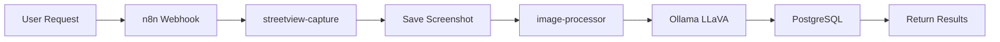
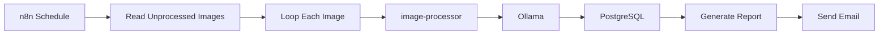

# GoodmoodDEV Multi-Container Architecture

Complete overview of all services in the modular automation platform.

## Container Inventory

| Service | Port | Purpose | Dependencies | Data Storage |
|---------|------|---------|--------------|--------------|
| **n8n** | 5678 | Workflow automation orchestrator | - | `./n8n-data` |
| **ollama** | 11434 | AI model inference (GPU) | NVIDIA GPU | `./ai-models` |
| **open-webui** | 12000 | Web UI for Ollama | ollama | `open-webui` volume |
| **postgres** | 5432 | Database for analysis results | - | `./postgres-data` |
| **streetview-capture** | 3000 | Google Street View screenshot automation | X11 | `./streetview-screenshots` |
| **image-processor** | 8000 | AI-powered image analysis | ollama, postgres | `./processed-results` |

## Architecture Diagram

```
┌─────────────────────────────────────────────────────────────────────┐
│                          n8n Workflow Engine                         │
│                         (localhost:5678)                             │
│                                                                      │
│  Orchestrates all services via HTTP APIs and webhooks               │
└──────┬──────────────┬──────────────┬──────────────┬────────────────┘
       │              │              │              │
       ├──────────────┼──────────────┼──────────────┘
       │              │              │
       v              v              v
┌──────────────┐ ┌──────────────┐ ┌──────────────────────────┐
│ Streetview   │ │    Image     │ │        Ollama            │
│   Capture    │ │  Processor   │ │   (AI Models - GPU)      │
│  :3000       │ │   :8000      │ │      :11434              │
└──────┬───────┘ └──────┬───────┘ └──────────┬───────────────┘
       │                │                     │
       │                │                     ├─> deepseek-r1:32b
       │                │                     ├─> gpt-oss:120b
       │                │                     └─> llava:13b (vision)
       │                │
       │                │
       v                v
┌─────────────────────────────────┐
│   Shared Volumes                │
├─────────────────────────────────┤
│ ./streetview-screenshots        │ ← Write
│    ├─> streetview-capture       │ ← Read
│    └─> image-processor          │
│                                 │
│ ./processed-results             │ ← Write
│    └─> image-processor          │
│                                 │
│ ./ai-models (92GB)              │ ← Shared
│    ├─> ollama                   │
│    └─> open-webui               │
└─────────────────────────────────┘

                    │
                    v
          ┌──────────────────┐
          │   PostgreSQL     │
          │      :5432       │
          │                  │
          │  streetview_     │
          │   analysis DB    │
          └──────────────────┘
```

## Service Details

### 1. n8n (Workflow Automation)

**Purpose**: Central orchestrator for all automation workflows

**Capabilities:**
- HTTP request execution
- Webhook handling
- Schedule-based triggers
- Data transformation
- Conditional logic
- Error handling

**Access:**
- Web UI: http://localhost:5678
- File access: /host-home (host filesystem)
- Credentials: Stored in `./n8n-data`

**Example Workflows:**
- Capture street view → Analyze with AI → Store results → Send notification
- Batch process multiple addresses
- Scheduled analysis of new images
- Custom reporting pipelines

---

### 2. Ollama (AI Model Server)

**Purpose**: GPU-accelerated AI model inference

**Models:**
- `llava:13b` (8.0 GB) - Vision language model
- `deepseek-r1:32b` (19 GB) - Language model
- `gpt-oss:120b` (65 GB) - Large language model

**Capabilities:**
- Text generation
- Image analysis (with LLaVA)
- Multi-modal understanding
- OpenAI-compatible API

**API Examples:**
```bash
# List models
curl http://localhost:11434/api/tags

# Generate text
curl http://localhost:11434/api/generate \
  -d '{"model": "deepseek-r1:32b", "prompt": "Hello"}'

# Analyze image (via image-processor)
curl http://localhost:8000/analyze \
  -d '{"filename": "image.jpg", "analyses": ["description"]}'
```

---

### 3. PostgreSQL (Database)

**Purpose**: Persistent storage for image metadata and analysis results

**Database:** `streetview_analysis`

**Tables:**
- `images` - Street view image metadata
- `analysis_results` - AI analysis outputs
- `detected_objects` - Object detection data
- `extracted_text` - OCR results
- `processing_queue` - Async job queue

**Access:**
```bash
# Connect to database
docker exec -it postgres psql -U imageprocessor -d streetview_analysis

# Query images
docker exec postgres psql -U imageprocessor -d streetview_analysis \
  -c "SELECT filename, address FROM images LIMIT 10;"
```

---

### 4. Streetview Capture

**Purpose**: Automated Google Street View screenshot capture

**Features:**
- Playwright browser automation
- Headless & visible modes (X11 support)
- Geocoding via OpenStreetMap
- Automatic consent handling
- Paired JPG + JSON outputs

**API:**
```bash
# Capture screenshot
curl -X POST http://localhost:3000/capture \
  -H "Content-Type: application/json" \
  -d '{
    "address": "Eiffel Tower, Paris",
    "headless": true,
    "quality": 85
  }'

# List captures
curl http://localhost:3000/captures

# Health check
curl http://localhost:3000/health
```

**Output:**
- Images: `./streetview-screenshots/*.jpg`
- Metadata: `./streetview-screenshots/*.json`

---

### 5. Image Processor

**Purpose**: AI-powered image analysis using vision models

**Features:**
- LLaVA 13B vision model via Ollama
- Multiple analysis types (description, OCR, object detection)
- Custom prompts
- Database storage
- Batch processing

**API:**
```bash
# Analyze image
curl -X POST http://localhost:8000/analyze \
  -H "Content-Type: application/json" \
  -d '{
    "filename": "streetview_Times_Square_2025-11-11.jpg",
    "analyses": ["description", "object_detection"]
  }'

# List processed images
curl http://localhost:8000/images

# Get results
curl http://localhost:8000/results/1
```

**Performance:**
- Processing: ~15-30 seconds per image
- GPU accelerated
- Concurrent: 1-2 requests recommended

---

### 6. Open WebUI

**Purpose**: Web interface for Ollama

**Features:**
- Chat interface for AI models
- Model management
- Conversation history
- Multi-user support

**Access:**
- Web UI: http://localhost:12000

---

## Communication Patterns

### Pattern 1: Direct API Calls
Services communicate via HTTP REST APIs on localhost

```
n8n → HTTP POST → streetview-capture → Returns screenshot metadata
```

### Pattern 2: Shared Volumes
Services read/write files to shared directories

```
streetview-capture → Writes → ./streetview-screenshots/image.jpg
image-processor → Reads → ./streetview-screenshots/image.jpg
```

### Pattern 3: Database
Services share data via PostgreSQL

```
image-processor → Writes → PostgreSQL
n8n → Reads → PostgreSQL (via SQL queries)
```

### Pattern 4: Event-Driven
n8n webhooks trigger automated workflows

```
External event → n8n webhook → Triggers workflow → Calls services
```

---

## Network Configuration

All services use `network_mode: host` for simplicity:
- **Advantages**: No network translation, easy localhost communication
- **Services**: Communicate via `localhost:PORT`
- **External Access**: Bind to specific ports only when needed

---

## Volume Structure

```
/home/goodmoodlab/goodmoodDEV/
├── ai-models/              # 92 GB - Shared AI models (Ollama)
├── n8n-data/               # n8n workflows and credentials
├── postgres-data/          # PostgreSQL database files
├── streetview-screenshots/ # Captured street view images
├── processed-results/      # Image analysis outputs
├── streetview-automation/  # Streetview-capture source
├── image-processor/        # Image-processor source
└── docker-compose.yml      # Service definitions
```

---

## Workflow Examples

### Example 1: Capture & Analyze



**Steps:**
1. User triggers n8n workflow with address
2. n8n calls streetview-capture API
3. Screenshot saved to shared volume
4. n8n calls image-processor API
5. Image analyzed by LLaVA via Ollama
6. Results stored in PostgreSQL
7. n8n returns final data

---

### Example 2: Scheduled Batch Processing



**Steps:**
1. n8n cron trigger (e.g., daily at 2 AM)
2. Query database for unanalyzed images
3. For each image, call image-processor
4. AI analyzes with LLaVA model
5. Store results in database
6. Generate summary report
7. Email report to stakeholders

---

## Resource Usage

| Service | CPU | Memory | Disk | GPU |
|---------|-----|--------|------|-----|
| n8n | Low | ~200MB | Minimal | No |
| ollama | Med-High | ~4-8GB | 92GB | Yes (NVIDIA) |
| postgres | Low | ~100MB | ~500MB | No |
| streetview-capture | Med | ~1-2GB | ~200MB | No |
| image-processor | Low | ~500MB | Minimal | Via Ollama |
| open-webui | Low | ~200MB | Minimal | No |

**Total:**
- Idle: ~6-8 GB RAM
- Active: ~12-16 GB RAM
- Disk: ~95 GB (mostly AI models)

---

## Development Guidelines

### Adding New Services

1. **Define service** in `docker-compose.yml`
2. **Choose network mode**: host (recommended) or custom network
3. **Set up volumes**: Shared data vs. persistent storage
4. **Configure dependencies**: `depends_on` for startup order
5. **Add health checks**: For reliability
6. **Document API**: In service README.md
7. **Update ARCHITECTURE.md**: Add to inventory and diagrams

### Service Communication

**Preferred:**
- REST APIs for synchronous operations
- Webhooks for event-driven workflows
- Shared volumes for large files (images, videos)
- Database for structured data and queries

**Avoid:**
- Message queues (unless high throughput needed)
- Complex service meshes (over-engineering)
- Tight coupling between services

---

## Monitoring & Logs

```bash
# View all containers
docker ps

# View specific service logs
docker logs -f <container-name>

# View resource usage
docker stats

# Health checks
curl http://localhost:3000/health  # streetview-capture
curl http://localhost:8000/health  # image-processor
curl http://localhost:11434/api/tags  # ollama
```

---

## Backup Strategy

**Critical Data:**
1. **n8n workflows**: `./n8n-data` - backup regularly
2. **PostgreSQL database**: `./postgres-data` - daily backups
3. **AI models**: `./ai-models` - one-time backup (or re-download)
4. **Screenshots**: `./streetview-screenshots` - archive old files

**Backup Commands:**
```bash
# Backup n8n
tar -czf n8n-backup-$(date +%Y%m%d).tar.gz n8n-data/

# Backup PostgreSQL
docker exec postgres pg_dump -U imageprocessor streetview_analysis > db-backup-$(date +%Y%m%d).sql

# Backup screenshots
rsync -av streetview-screenshots/ /backup/streetview-screenshots/
```

---

## Future Expansion Ideas

- **Video Processing Service**: Analyze video clips
- **Redis Cache**: Speed up repeated analyses
- **MinIO/S3**: Cloud storage integration
- **Grafana Dashboard**: Metrics visualization
- **API Gateway**: Unified API endpoint
- **Authentication Service**: OAuth/JWT for APIs

---

## Support & Documentation

- **Architecture**: This file
- **n8n**: ./n8n-data/ (workflows)
- **Streetview Capture**: ./streetview-automation/README.md
- **Image Processor**: ./image-processor/README.md
- **Docker Compose**: ./docker-compose.yml

For issues:
```bash
# Check all services
docker compose ps

# Restart all
docker compose restart

# View logs
docker compose logs -f

# Rebuild specific service
docker compose up -d --build <service-name>
```
